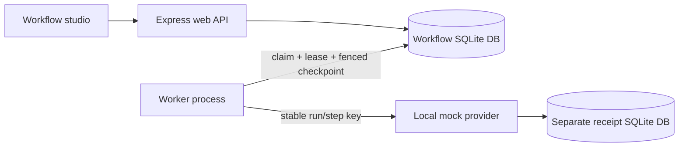

# Relay architecture

The browser defines bounded declarative steps. The web process validates and stores drafts, publishes immutable versions, and queues runs. Separate workers claim runs from the same database. The mock provider persists receipts independently so its effect and the app checkpoint cannot accidentally be treated as one transaction.

## Pin the program before executing it

A run references a specific published version, not the current editable draft. Otherwise a restart could resume a different sequence of steps from the one that already produced effects. Draft writes use optimistic versions; publishing captures validated steps transactionally. Run-request idempotency binds its key to intent, so repeated submission does not silently queue duplicate work.

The allowed types are transform, wait, and simulated notification. This deliberately excludes arbitrary code and URLs. A small fixed language keeps the durability problem visible without pretending that a convenience VM is a secure code sandbox.

## A lease is temporary ownership

Worker claims persist lease identity and deadline. Checkpoints, renewal, completion, and cancellation handling must verify that identity and current run state. A worker whose lease expired can still be alive; it must not overwrite the new owner's progress after reclaim. Killing a worker tests recovery but does not prove rejection of a still-running stale writer, so the suite separately submits an old claim after a new claim exists.

Waiting and external work happen outside a long-lived SQL write transaction. Persisted checkpoints let a later worker skip completed steps and rebuild the output chain. Outputs stay in SQLite with explicit bounds; no checkpoint points into a process's vanished memory.

The aggregate HTTP JSON limit is 256 KB. Per-field character limits do not override that request cap. Each output is serialized and checked against a 64,000-byte UTF-8 limit before checkpointing. This keeps the local persistence contract explicit rather than silently offloading large values into volatile memory.

## The gap between effect and checkpoint

The provider may commit a notification receipt and the worker may die before recording success. On restart, the app cannot infer the effect's absence merely from its missing checkpoint. It retries with a stable run/step key. The local provider stores the key, a request fingerprint, and its result; matching retries return that result without another effect. Changed intent under a reused key conflicts.

That is a guarantee about a cooperating durable provider. Database fencing protects app checkpoints, not arbitrary remote effects. A real service without idempotency support requires weaker delivery semantics, explicit uncertainty, or reconciliation. Cancellation likewise cannot roll back an already-accepted effect.

## Evidence boundaries

The crash test exits the worker at the difficult boundary, inspects the separate receipt store and missing checkpoint, then restarts without the failpoint and verifies completion with one receipt. Other tests cover competing workers, stale tokens, pinned versions, retries, cancellation, input validation, and output persistence. Each test's result is recorded separately from the intended design.

SQLite and synchronous calls are a local-teaching tradeoff, not a distributed-scale claim. A production runner would need real identity, operational metrics, capacity planning, durable large-object storage if limits grow, integration-specific retry policies, and stronger deployment controls. Those additions should preserve the explicit ownership and idempotency boundaries rather than replace them with reassuring labels.
